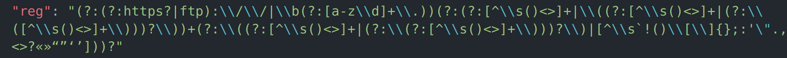

# The Regex PII detection

1. It uses regex to detect pii
2. The regex code is in utils.ts
3. The detection code is in detetion.ts
4. The file data.ts is used for dummy data

## How to run?

```bash
tsc detection.ts --resolveJsonModule

node detection.js
```

## PII regex & It's origin

| PII Name                           | Regex                                                                 | Source                                                                                                                                                                                                                                | Is modified |
| ---------------------------------- | --------------------------------------------------------------------- | ------------------------------------------------------------------------------------------------------------------------------------------------------------------------------------------------------------------------------------- | ----------- |
| Name                               | ^[a-zA-Z\\\s'-]+$                                                     | [LINK](https://hwang.cisdept.cpp.edu/swanew/Text/Common-Regex.htm)                                                                                                                                                                       | YES         |
| Indian Phone Number                | ^(?:\\+91\\\\0)?[6789]\\\d{9}$                                        | [LINK](https://stackoverflow.com/questions/3813195/regular-expression-for-indian-mobile-numbers)                                                                                                                                         | YES         |
| Bank Account Number                | ^\\d{18}$                                                             | [LINK](https://www.freecodecamp.org/news/what-does-d-mean-in-regex/)                                                                                                                                                                     | NO          |
| Credit Card Number                 |                         | [LINK](https://www.regular-expressions.info/creditcard.html)                                                                                                                                                                             | NO          |
| User Email                         | [a-zA-Z0-9._%+-]+@[a-zA-Z0-9.-]+\\.[a-zA-Z]{2,}$                      | [LINK](https://gist.github.com/cgkio/7268045)                                                                                                                                                                                            | YES         |
| Address                            | ^(\\d{1,}) [a-zA-Z0-9\\s]+(\\,)? [a-zA-Z]+(\\,)? [A-Z]{2} [0-9]{5,6}$ | [LINK](https://uibakery.io/regex-library/street-address-regex-java)                                                                                                                                                                      | NO          |
| IP Address                         |                         | [LINK](https://www.oreilly.com/library/view/regular-expressions-cookbook/9780596802837/ch07s16.html)                                                                                                                                     | NO          |
| MAC Address                        |                         | [LINK](https://stackoverflow.com/questions/4260467/what-is-a-regular-expression-for-a-mac-address)                                                                                                                                       | NO          |
| IMSI                               | ^[0-9]{5,15}                                                          | [LINK](https://stackoverflow.com/questions/44940763/regex-for-numbers-between-0-9-and-15-digits-as-limit)                                                                                                                                | NO          |
| PAN CARD                           | [A-Z]{5}[0-9]{4}[A-Z]{1}                                              | [LINK](https://www.geeksforgeeks.org/how-to-validate-pan-card-number-using-regular-expression/)                                                                                                                                          | NO          |
| Debit Card                         |                         | [LINK](https://debugpointer.com/regex/regex-for-debit-card)                                                                                                                                                                              | NO          |
| Browser Name                       |                         | [LINK](https://stackoverflow.com/questions/17805464/using-regex-to-retrieve-browser-name)                                                                                                                                                | NO          |
| OS name                            |                         | [LINK](https://stackoverflow.com/questions/4246394/regex-to-detect-os-version-in-javascript)                                                                                                                                             | YES         |
| Date                               | \\d{1,2}\\/\\d{1,2}\\/\\d{2,4}                                        | [LINK](https://www.freecodecamp.org/news/regex-for-date-formats-what-is-the-regular-expression-for-matching-dates/)                                                                                                                      | YES         |
| Zip code                           | ^[0-9]{5}(?:-[0-9]{4})?$                                              | [LINK](https://www.oreilly.com/library/view/regular-expressions-cookbook/9781449327453/ch04s14.html)                                                                                                                                     | NO          |
| SSN                                |                         | [LINK](https://uibakery.io/regex-library/ssn)                                                                                                                                                                                            | NO          |
| International Driving License      |                         | [LINK](https://stackoverflow.com/questions/61129744/regex-pattern-for-driving-licence-validation)                                                                                                                                        | YES         |
| Gender                             |                         | [LINK](https://www.geeksforgeeks.org/validate-gender-using-regular-expressions/)                                                                                                                                                         | NO          |
| International Passport number      |                         | [LINK](https://stackoverflow.com/questions/40647728/regex-for-passport-number)                                                                                                                                                           | NO          |
| Financial information              |                         | [LINK](https://howtodoinjava.com/java/regex/java-regex-match-any-currency-symbol/#:~:text=Regex%20for%20Currency%20Symbols,currency%20symbols%20in%20the%20string.&text=Note%20that%20%5Cp%7BSc%7D,Javascript%20doesn't%20support%20it.) | YES         |
| Geolocation (Latitude)             |                         | [LINK](https://stackoverflow.com/questions/3518504/regular-expression-for-matching-latitude-longitude-coordinates)                                                                                                                       | NO          |
| Geolocation (Longitude)            |                         | [LINK](https://stackoverflow.com/questions/3518504/regular-expression-for-matching-latitude-longitude-coordinates)                                                                                                                       | NO          |
| URL                                |                         | [LINK](https://www.regextester.com/96504)                                                                                                                                                                                                | NO          |
| Indian Vehicle Registration Number |                         | [LINK](https://www.etl-tools.com/regular-expressions/is-indian-vehicle-registration-number.html)                                                                                                                                         | NO          |
| IMEI                               | \\d{2}-\\d{6}-\\d{6}-\\d{2}                                           | [LINK](https://news.ycombinator.com/item?id=30104009)                                                                                                                                                                                    | NO          |
| Addhar Card                        | ^d{4}sd{4}sd{4}$                                                      | [LINK](https://debugpointer.com/regex/regex-for-aadhaar-number)                                                                                                                                                                          | YES         |
| International Phone Number         |                         | [LINK](https://uibakery.io/regex-library/phone-number)                                                                                                                                                                                   | NO          |
